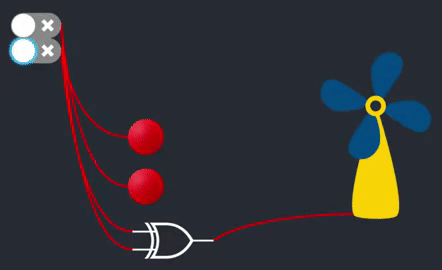

# 🔗 react-dfd
Clean, prettified and intuitive Dataflow Digrams for React.

<p align="center">
  
</p>

## 🤔 Why does this exist?
[react-dfd]() allows us to create [React](https://github.com/facebook/react) applications that rely upon the principles of _dataflow_, with the added benefit of being able to visualize the resultant diagrams.

  - This enables simple inspection of the relationships between modules of your app.
  - It ensures clean, readable flow diagrams without requiring the developer to worry about all the wiring.
  - Since it's backed by React, it's trivial to:
    - Easily design, introduce and publish new blocks.
    - Share your diagrams over the web, or in native runtimes.
    - Wrap up complex stateful behaviour inside simple-to-use, intuitive building blocks.
  - Design dataflow algorithms using the React DOM directly:
    - You don't need to allocate any abstractions.
    - It abides by core React principles, so it behaves the way you'd expect it to.
  - These aren't just static, predefined diagram elements; these are _real_ components, which can behave and interact however you want.

## 🚀 Getting Started

Using [`npm`]():

```bash
npm install --save react-dfd
```

Using [`yarn`]():

```bash
yarn add react-dfd
```

## 🎒 Examples

This project is a frontend compatible with [react-dataflow](https://github.com/cawfree/react-dataflow). If you haven't already, it's advisable to check out the [tutorial](https://github.com/cawfree/react-dataflow) on how to write applications for [React](https://github.com/facebook/react) using wires.

To summarize, [react-dataflow]() is a _data first_ perspective of React, whereby components represent actual elements of business logic. The overall functionality of your application is how these elements _are connected_. [react-dataflow]() states that it takes advantage of React's perceptive DOM diffing architecture to optimize and execute chains of dependent computation, and treats the ability to render an equivalent UI as a second-class citizen.

### 💡 Simple Indicator

In this example, we'll hook up a simple switch to a light emitting diode. This is effectively the _graphical_ counterpart to [react-dataflow]()'s [business logic example](https://github.com/cawfree/react-dataflow#complete-example). The reason this is a useful example is that you will find most applications where a dataflow processing model can be applied can normally be expressed as a circuit.

```javascript
import React from 'react';
import PropTypes from 'prop-types';
import { useWire } from 'react-dataflow';
import Bulb from 'react-bulb';
import Switch from 'react-switch';

import { withFlow, withFlowDiagram } from 'react-dfd';

// XXX: Define a simple LightBulb, which will turn on
//      when the active prop becomes truthy.
const LightBulb = ({ active }) => (
  <Bulb
    size={20}
    color={active ? 'lime' : 'green'}
  />
);

// XXX: It is important to know the size of the component
//      before rendering, so we need to provide the width
//      and height. These are done using "flowProps"; they
//      are very similar to propTypes; in fact, they actually
//      resolve the propTypes for you. But they provide some
//      additional information which help with constructing
//      the diagram which must be known before they are
//      instantiated.
LightBulb.flowProps = {
  width: 40,
  height: 40,
  // XXX: Inlets describe the configuration of input props which
  //      can be wired to, alongside how you want them to be
  //      rendered and positioned on the diagram.
  inlets: {
    // XXX: Describe a boolean input, which we'll draw using
    //      just an empty fragment. We'll position this 10 units
    //      from the top of the FlowBulb (this helps to control
    //      where wires are drawn to).
    active: [PropTypes.bool, React.Fragment, { top: 10 }],
  },
};

const FlowLightBulb = withFlow(LightBulb);

// XXX: Define a class which will draw a switch, which when
//      toggled, will export the current value to the 
//      connected wires.
const Toggle = ({ Export }) => {
  const [ checked, onChange ] = useState(false);
  // XXX: When the Switch is pressed, we will export the property
  //      "pressed" along any connected wires.
  return (
    <Export
      pressed={checked}
    >
      <Switch
        onChange={onChange}
        checked={checked}
      />
    </Export>
  );
};

Toggle.flowProps = {
  width: 55,
  height: 28,
  outlets: {
    pressed: [PropTypes.bool, React.Fragment, { /* use default positioning */ }],
  },
};

const FlowToggle = withFlow(Toggle);

// XXX: Here's the resulting app! Just toggle the... toggle... to turn the LightBulb on and off.
const App = () => {
  const wire = useWire();
  return (
    <>
      <FlowToggle
        pressed={wire}
      />
      <FlowLightBulb
        active={wire}
      />
    </>
  );
};

export default withFlowDiagram(
  (props) => (
    <App
      {...props}
      width={500}
      height={500}
    />
  ),
);
```

## API

[react-dfd]() implements a small range of public operations and concepts to achieve some complex operations in dataflow. In truth, you only really care about three basic concepts; `flowProps`, `withFlow` and `withFlowDiagram`, which are described in detail below.

### flowProps
These are a `static` class variable which describe some required properties to achieve dataflow about a particular React Component. These usually come in the following form:

```javascript
SomeComponent.flowProps = {
  width: 100,
  height: 100,
  inlets: {
    A: { PropTypes.bool, React.Fragment, { left: 5 } },
  },
  outlets: {
    B: { PropTypes.bool, React.Fragment, { left: 25 } },
  },
};
```

Any component which we want to use on the diagram **must** at the bear minimum define `flowProps`, which define numeric non-zero, non-negative `width` and `height` properties. These are used to _inform_ the diagram distirbution engine of the target size of the components _before they are rendered_; this is key in order to generate collision-free distributions on the dataflow diagram.

There are in addition, two optional object properties which can be specified; `inlets` and `outlets`. These respectively describe the inputs and outputs properties the component is _expected_ to be passed using wires on the diagram. They are designed to emulate how we normally expect [PropTypes](https://reactjs.org/docs/typechecking-with-proptypes.html) to work; in essence, we define specific property keys of the component, which when wired, are expected to carry a certain value which conforms the the type checking rule.

Alongside the traditional conventions of defining property types, implements are also expected to define _two_ additional fields in the array; a `Component` field, and a `style` field, i.e.:

```javascript
inlets: {
  MyNumericInput: [
    PropTypes.number.isRequired,
    SomeComponentToDraw,
    someStyleToDetermineWhereComponentIsDrawn,
  ],
}
```

These are helped to exert fine tuning and customization of the wiring process; implementors can define _exactly_ the position they want [react-dfd]() to wire to, meanwhile the specified component will help the readability of your block; you can define a custom wire termination component.

**Please note**, these are _not_ a drop-in replacement for PropTypes; these are **only** used to define the configuration of properties which you intend _to wire between_. You must keep in mind that is perfectly legal to pass non-wired props into dataflow components; these therefore need type checking independently of what is provided by [react-dfd]().

### withFlow(Component: required)

`withFlow` is used to allocate a particular React Component with all of the required context to be treated and rendered as a dataflow element. When rendered, the dataflow diagram will decide where on screen to render this component based upon the surrounding context, and magically connect all of the defined wires.

Any components wrapped `withFlow` **must** define static `flowProps`, otherwise this call will fail to complete.

### withFlowDiagram(Component: required)
This is the top-level [HOC](https://reactjs.org/docs/higher-order-components.html) which must wrap the root of your diagram, as it provides all of the global functionality and shared resources in order to generate and synchronize your dataflow diagram.

## ✌️ License
[MIT]()

<p align="center">
  <a href="https://www.buymeacoffee.com/cawfree">
    
  </a>
</p>

